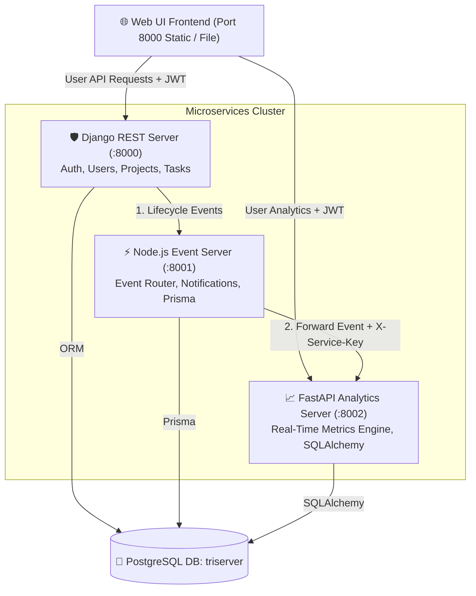

# 🚀 Multi-Server System: Task Management & Real-Time Analytics Engine


A distributed microservices system combining **Django**, **Node.js Express**, and **FastAPI** to deliver real-time task lifecycle management, event-driven notification routing, and automated task analytics.

---

## 📐 System Architecture



---

## 🧩 Microservices Overview

### 1. 🛡️ Django Task Management Server (`:8000`)
* **Path**: [`services/Django`](file:///f:/multi-server-system/services/Django)
* **Responsibility**: System source of truth for Users, Projects, and Task state transitions.
* **Key Features**:
  - Central JWT Authentication Authority (`/api/auth/token/`).
  - Role-Based Access Control (**ADMIN** vs **USER**).
  - Enforces project ownership and task self-assignment security rules.
  - Automatically dispatches lifecycle events (`TASK_CREATED`, `TASK_STATUS_CHANGED`, `TASK_COMPLETED`, `TASK_REOPENED`) to Node.js.

### 2. ⚡ Node.js Event Server (`:8001`)
* **Path**: [`services/Node`](file:///f:/multi-server-system/services/Node)
* **Responsibility**: Asynchronous event ingestion, notification distribution, and analytics relay.
* **Key Features**:
  - Express.js server backed by Prisma ORM.
  - Receives event streams from Django and persists event history in PostgreSQL.
  - Relays task event payloads downstream to FastAPI Analytics Server with secure `X-Service-Key` authentication.
  - Exposes health endpoints (`/health`, `/health/db`) and notification feeds.

### 3. 📈 FastAPI Analytics Server (`:8002`)
* **Path**: [`services/FastAPI`](file:///f:/multi-server-system/services/FastAPI)
* **Responsibility**: Real-time analytical processing, completion time calculation, and status transition metrics.
* **Key Features**:
  - Dual-Security Architecture (`X-Service-Key` for service ingestion vs `Bearer JWT` for frontend metrics).
  - Calculates precise completion duration (`completion_time_seconds`) and tracks state transition counts.
  - Provides aggregated user/system metrics (`GET /api/metrics/summary`) with RBAC scoping.
  - Provides individual task metrics breakdowns (`GET /api/metrics/tasks/{task_id}`).

### 4. 🎨 Interactive Web Frontend
* **Path**: [`frontend/index.html`](file:///f:/multi-server-system/frontend/index.html)
* **Responsibility**: Single-page modern interface for task lifecycle management and real-time analytics visualization.
* **Key Features**:
  - Real-time health monitoring of all 3 microservices.
  - One-click task workflow buttons (*Start*, *Complete*, *Pause*, *Reopen*).
  - Dynamic **Analytics Drawer** per task and dedicated **Real-Time Analytics Summary** tab.

---

## 🔒 Security & Authentication Architecture

The system enforces a dual-authentication mechanism:

| Flow Type | Target Endpoint | Credential | Header | Purpose |
| :--- | :--- | :--- | :--- | :--- |
| **User Access** | Django & FastAPI APIs | Signed JWT Token | `Authorization: Bearer <TOKEN>` | User identity verification & RBAC scoping |
| **Service-to-Service** | Node ➔ FastAPI (`/internal/events`) | Shared Secret | `X-Service-Key: <SECRET>` | Secure event ingestion between microservices |

### Default Seeded Users (Password: `Password123`)

| Email | Username | Role | Privileges |
| :--- | :--- | :--- | :--- |
| `admin@gmail.com` | `admin` | **ADMIN** | Full system visibility; view global metrics; assign tasks across users |
| `kimiko@gmail.com` | `kimiko` | **USER** | Manage personal projects/tasks; view owned analytics |
| `mayank@gmail.com` | `mayank` | **USER** | Manage personal projects/tasks; view owned analytics |

---

## ⚡ Quick Start Guide

### Prerequisites
* Python 3.11+
* Node.js 20+
* PostgreSQL 16+ running locally with database `triserver`

### 1. Launch All Servers

#### On Windows (PowerShell):
```powershell
.\start.ps1
```

#### On Linux / macOS (Bash):
```bash
chmod +x start.sh
./start.sh
```

---

## 🛠️ API Reference Table

### 🛡️ Django Server (`http://127.0.0.1:8000`)
* `POST /api/auth/token/` — Obtain JWT Access & Refresh tokens.
* `GET /api/users/` — List users (Requires JWT).
* `GET /api/projects/` | `POST /api/projects/` — Project CRUD (Requires JWT).
* `GET /api/tasks/` | `POST /api/tasks/` — Task management (Requires JWT).
* `PATCH /api/tasks/{id}/` — Update task status / details.

### ⚡ Node.js Event Server (`http://127.0.0.1:8001`)
* `GET /health` — Service health check.
* `GET /health/db` — PostgreSQL Prisma health check.
* `POST /internal/events` — Ingest internal system events from Django.
* `GET /api/events` — Fetch event logs (Requires JWT).

### 📈 FastAPI Analytics Server (`http://127.0.0.1:8002`)
* `GET /health` — Service health check.
* `POST /internal/events` — Receive events from Node.js (Requires `X-Service-Key`).
* `GET /api/metrics/summary` — Aggregate task summary metrics (Requires JWT).
* `GET /api/metrics/tasks/{task_id}` — Detailed metrics for a task (Requires JWT).
* `GET /docs` — Swagger OpenAPI Documentation UI.

---

## 📂 Service Audit Reports

For detailed security, schema, and API audits for individual services, refer to:
* 🛡️ [Django Audit Report](file:///f:/multi-server-system/services/Django/audit.md)
* ⚡ [Node.js Event Server Audit Report](file:///f:/multi-server-system/services/Node/audit.md)
* 📈 [FastAPI Analytics Audit Report](file:///f:/multi-server-system/services/FastAPI/audit.md)
